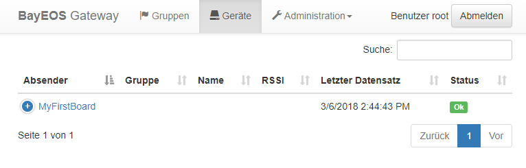

# 

A sensor gateway to receive, check and aggregate observation data

Main characteristics:

- Import service for observation data ([BayEOS Frames](https://www.bayceer.uni-bayreuth.de/bayeos/frames) over HTTP)
- Completeness and value checks
- Interpolation and aggregation of observation data
- Live charts of measured values
- Export service to [BayEOS Server](https://github.com/BayCEER/bayeos-server)

## Getting Started

### Prerequisites

- Debian 11 (bullseye)
- Root login

### Installing

- Login as root
- Install basic tools for installation  
  `apt-get update`  
  `apt-get install wget gnupg`
- Import the repository key  
  `wget -O - http://www.bayceer.uni-bayreuth.de/repos/apt/conf/bayceer_repo.gpg.key |apt-key add -`
- Add the BayCEER Debian repository  
  `echo "deb http://www.bayceer.uni-bayreuth.de/repos/apt/debian $(lsb_release -c -s) main" | tee /etc/apt/sources.list.d/bayceer.list`
- Update your repository cache  
  `apt-get update`
- Install the package  
  `apt-get install bayeos-gateway`

### Configuration

- Open the URL `http://localhost/gateway` and log in as user 'root' with password 'bayeos'
- Open the administration menu and change the default root password

### My First Data Producer

Let's send the cpu load of our pc to a local gateway:

- Install the [python-bayeosgatewayclient](https://github.com/BayCEER/bayeosgatewayclient) module
- Install the python [psutils](https://pypi.python.org/pypi/psutil) module
- Run [MyFirstBoard.py](docs/MyFirstBoard.py)
- Open `http://localhost/gateway` to identify our new board record

- Set the board name
- Set the channel names and units
- Configure 10min average aggregation on each channel
- Turn the board auto export option on
- Access the board data on a [BayEOS Server](https://github.com/BayCEER/bayeos-server)

## Authors

- **Dr. Stefan Holzheu** - _Project lead_ - [BayCEER, University of Bayreuth](https://www.bayceer.uni-bayreuth.de)
- **Oliver Archner** - _Developer_ - [BayCEER, University of Bayreuth](https://www.bayceer.uni-bayreuth.de)

## History

### Version 2.8.3, Sept., 2022
- FrameParser updated to 1.4.0
- BoardCommand responseStatus property
- Fixed: Dropped encoding in frame callbacks 
- Updated: BoardCommandRestController and docs

### Version 2.8.2, Sept., 2022
- Changes: Login with full username (user@domain)
- Fixed: Websocket connect error
- Fixed: Remember-me token username
- Fixed: Dropped logging folder 
- Fixed: Server logging format simplified

### Version 2.8.1, Sept., 2022
- Fixed: Missing import in FileExport class

### Version 2.8.0, July, 2022

- Enhancement: Set channel names from channel nr
- Enhancement: Rename board origin
- Enhancement: Remember-me token
- Enhancement: Frame save callback
- Enhancement: Post Frame dialog 
- Enhancement: Board command UI
- Enhancement: Board command REST API

- Upgrade: JRE 11
- Upgrade: Spring 2.6
- Upgrade: SL4J with Logback

### Version 2.6.15, June, 2021

- Enhancement: Show multi line board comments
- Enhancement: Edit board comments

### Version 2.6.14, June, 2021

- BugFix: Wrong like operator in query to identify boards by origin

### Version 2.6.13, June, 2021

- BugFix: Create LDAP users without password

### Version 2.6.12, Apr, 2021

- BugFix: Edit channel if user domain is not null

### Version 2.6.11, Apr, 2021

- Enhancement: Ignore auto-export flag of boards in CalculateJob
- Enhancement: Removed needless query on channel flag in ExportJob

### Version 2.6.10, Apr, 2021

- Fixed Bug: Editing flow spline
- Fixed Bug: Missing save button on new channel template dialog

### Version 2.6.9, Mar, 2021

- Add User Rest API

### Version 2.6.8, Mar, 2021

- JRE definition openjdk-8-jre-headless

### Version 2.6.7, Mar, 2021

- Better channel read performance
- Fixed Bug: Edit User Dialog: Save sets password to null
- Fixed Bug: Edit Channel Dialog: Set auto export flag on channel not saved
- Fixed Bug: CommentRestController: Get response date without time information

### Version 2.6.6, Feb, 2021

- [Comment REST API enhancement](docs/board_comment_rest_api.md)

### Version 2.6.5, Sep, 2020

- Fixed locale problems

### Version 2.6.4, July, 2020

- Keep all channel observations until channel is synched

### Version 2.6.3, May, 2020

- Refined upload notifications

### Version 2.6.2, April, 2020

- Default import file size limit 4GB

### Version 2.6.1, March, 2020

- Import feedback by e-mail
- Enhanced upload list display

### Version 2.6.0, March, 2020

- Binary Logger file uploads

### Version 2.5.2, Dec, 2019

- Fixed: Default binding on localhost only
- Fixed: Channel path view

### Version 2.5.1, Sep, 2019

- Fixed wrong column name in view nagios_status

### Version 2.5.0, July, 2019

- State calculation and alerting for devices and device groups
- DelayedSecondFrame support
- Enhanced login dialog with domain drop down
- REST Interface for channel observations
- [Fixed: Incomplete spline function crashes export job](https://github.com/BayCEER/bayeos-gateway/issues/49)

### Version 2.4.10, April 15, 2019

- [Fixed: Message not shown after board has been moved to a new domainissue](https://github.com/BayCEER/bayeos-gateway/issues/51)

### Version 2.4.9, December 13, 2018

- Enhanced metrics with board, domain and user counts and calculated frames/h

### Version 2.4.8, November 28, 2018

- [Fixed: Message not shown in GUI bug](https://github.com/BayCEER/bayeos-gateway/issues/50)

### Version 2.4.7, November 22, 2018

- Improved DeleteJob performance
- LDAP: User search
- Grafana search and query for non domain users

### Version 2.4.5, November 13, 2018

- New attributes for users
- LDAP: Fetch empty user attributes
- LDAP: Optional user password

### Version 2.4.3, November 11, 2018

- Report metrics data to redis
- Linux like configuration in /etc/bayeos-gateway/application.properties
- Constant values in virtual channel functions
- Fixed performance bug in group and device list

### Version 2.4.0, October 17, 2018

- [Multitenancy based on domains](https://github.com/BayCEER/bayeos-gateway/issues/34)
- [LDAP Authentication](https://github.com/BayCEER/bayeos-gateway/issues/44)

### Version 2.3.0, July 30, 2018

- [Enhanced sync of objects between gateway and server](https://github.com/BayCEER/bayeos-gateway/issues/33)
- [Exclude critical values from export](https://github.com/BayCEER/bayeos-gateway/issues/27)
- Create NaN values for out of range numeric spline values
- Internal configuration table for export job dropped

### Version 2.2.21, March 20, 2018

- Fixed delete_obs() procedure bug caused by wrong transaction isolation level

### Version 2.2.20, March 6, 2018

- Enhanced usability in board list
- Fixed incomplete aggregation bug

### Version 2.1, March 30, 2017

- Virtual channels
- Live board list

### Version 2.0, March 1, 2017

- Rewrite and migration to Spring 4.0
- Multilanguage support
- Browser time zones
- Grafana interface
- Board groups
- Embedded web server
- Usability enhancements based on web flows

### Version 1.9.36, Dec 1, 2017

- Final Grails version

### Version 1.8.0, 2015

- [Responsive design](https://getbootstrap.com/) for mobile devices
- Debian package

### Version 1.0, 2012

- Initial release

## License

GNU LESSER GENERAL PUBLIC LICENSE, Version 2.1, February 1999
