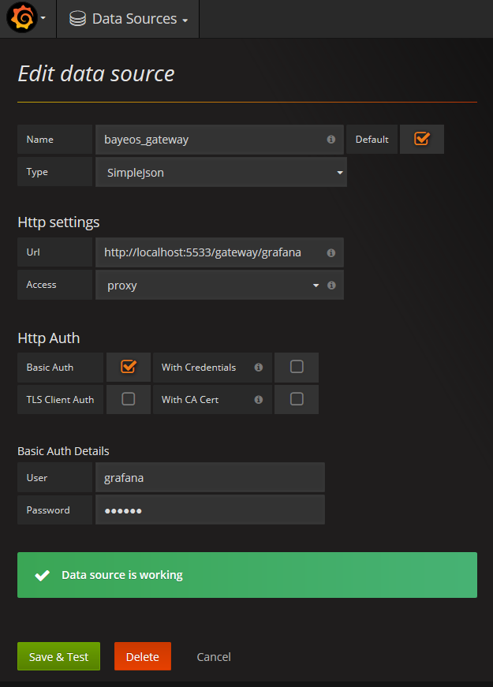
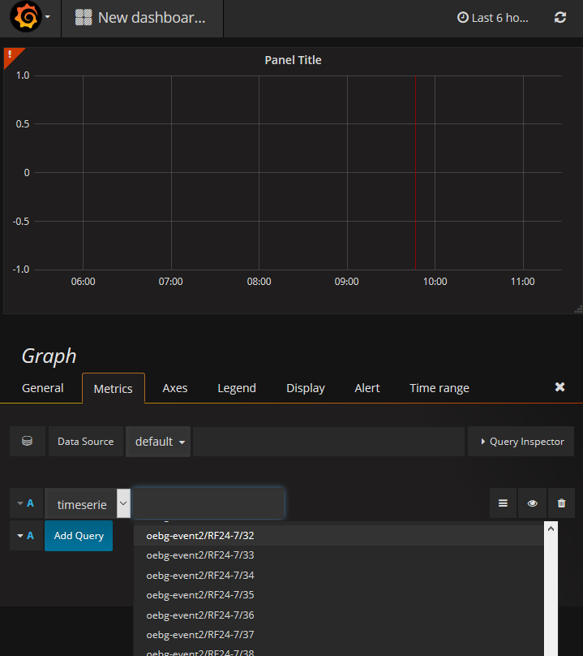
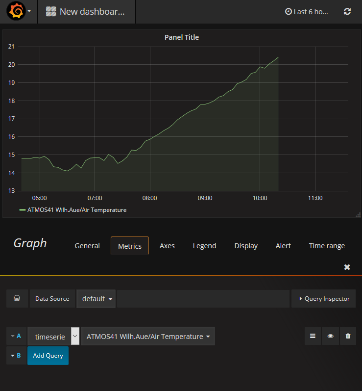

# Grafana How-to
<<<<<<< HEAD
This is a short instruction on how to use BayEOS Gateway observation data in Grafana. The combination allows you to produce all types of good looking dashboards based on your own  gateway data.
=======
This is a short instruction on how to use BayEOS Gateway observation data in Grafana. This combination allows you to produce all types of good looking dashboards based on your own live data.
>>>>>>> 6adce544549f54995878fedf7bd6073ea2c0453e

## Requirements
- Debian/Ubuntu machine with root privileges
- [BayEOS Gateway](https://github.com/BayCEER/bayeos-gateway)

## Installation 
1. Grafana Server 
Please follow the installation instruction on the [Grafana page](https://grafana.com/) to install the latest grafana server on your machine.
1. Grafana JSON Plugin
    - The Grafana server communicates with the BayEOS Gateway over a [JSON based REST interface](https://github.com/BayCEER/bayeos-gateway/blob/master/docs/grafana_endpoint.md). Please go to the grafana plugin site and install the latest [SimpleJson data source plugin](https://grafana.com/plugins/grafana-simple-json-datasource).
    - Create a new user with role IMPORT on the gateway.
1. Gateway Datasource
    - On a running grafana server login as admin user
    - Create a new SimpleJson data source with your new user:
    
    - Test the data source

## Dashbord Example
Let's verify if everthing works as expected and create a new dashboard based on gateway data:
1. Login on your grafana server
1. Go on Dashboards/New Dashboard
1. Add a new panel of your preferred type, for example a chart panel
1. Click on the panel title 
1. Click on edit to open the setting dialog
1. Open the metrics tab
1. Add a new query
1. Choose your gateway data source on the data source drop down
1. Type in a valid channel path name on the metric drop down to pick a gateway channel:
 
1. The observation values are shown on your grafana panel element:
 
1. Relax and create more dashboards :sunglasses: 

